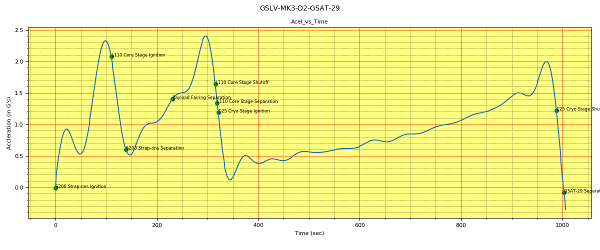
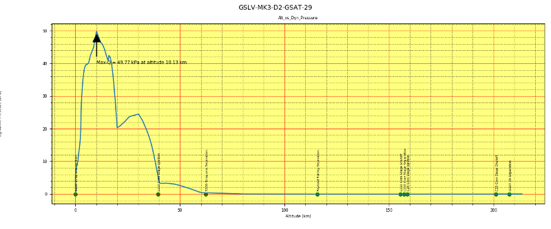
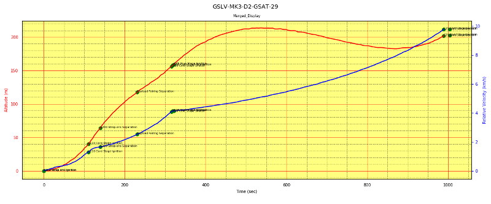
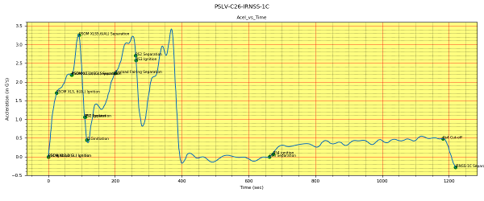
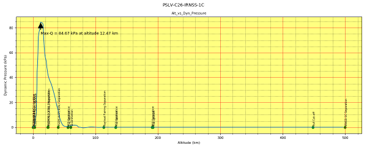
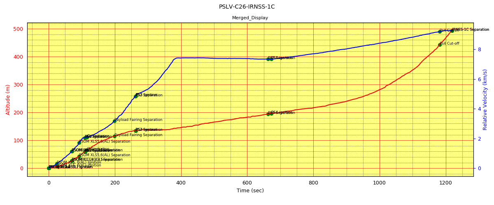
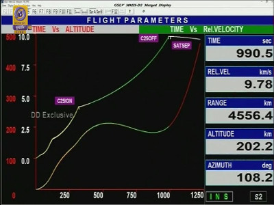
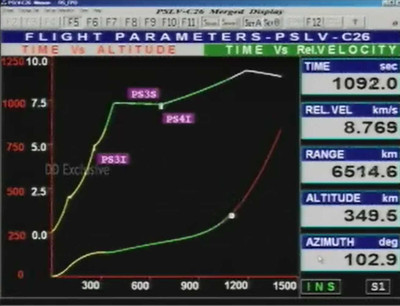
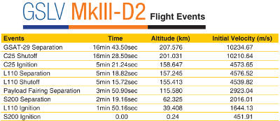
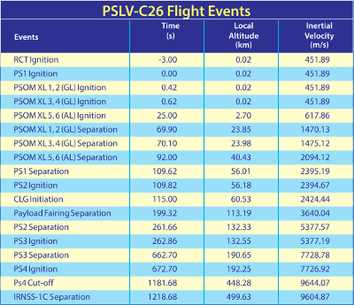

# Launch Vehicle Flight Profile (PSLV, GSLV Mk-III)
> This script creates profile plots for altitude, velocity, acceleration and dynamic pressure.   

## Table of contents
* [General info](#general-info)
* [Screenshots](#screenshots)
* [Setup](#setup)
* [How to run ](#how)
* [Updates](#updates)
* [To-do list](#to-do)

## Screenshots
Output maps generated by the script.    
   
 

## General info
This project was started as a result of non-availability of ISRO launch vehicle profile plots. Data is included for one mission of PSLV and GSLV Mk-III each and can be extended as explained below.  This script generates plots with altitude, velocity, acceleration and dynamic pressure profiles.  
&nbsp;   
With the lack of publicly available data, I ended-up extracting data from the screen shot of the televised launch.  Used the software [Engauge Digitizer](https://markummitchell.github.io/engauge-digitizer/) 
to extract data points from images of graphs. These image plots contains both altitude and relative velocity against time on the same graph (ISRO's merged display plots).   
   
    

Extracted data files are   

1.  gslv-mk3-d2-gsat29-48-alt.dat  
2.  gslv-mk3-d2-gsat29-48-vel.dat  
3.  pslv-c26-irnss-1c-11-alt.dat  
4.  pslv-c26-irnss-1c-11-vel.dat   

&nbsp;   
Additional data's were collected from flight events listing on  the launch vehicle brochure. They are converted as dat files.    

   
   

Extracted data files are    

1.  gslv-mk3-d2-gsat29-flight-events.dat  
2.  pslv-c26-irnss-1c-flight-events.dat   

&nbsp;   
Atmospheric density information's are interpolated from the tables under the data file named,   

1.  atm_data.dat   

## Setup
Script is written with python (Version: 3.6) on linux. Additional modules required :   

* numpy  (tested with Version: 1.18.4 )
* matplotlib  (tested with Version: 2.1.1 )
* scipy (tested with Version:  0.19.1 )

## How to run   
* Verify and install required modules 
* run `python flight_profile.py`. 
* It generates six png files at the current directory and opens the plot window one by one.  

## Updates

## To-do list
* Other launch profile plots.

